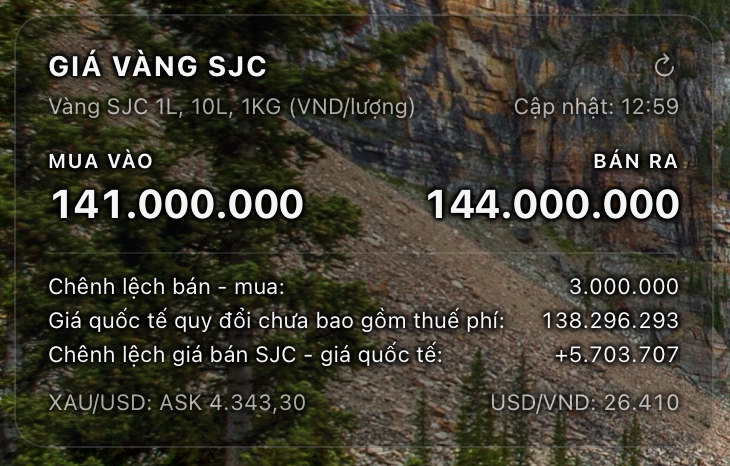

# sjc.widget
Một widget Übersicht hiển thị giá vàng SJC 1 lượng kèm chênh lệch với giá giao ngay quốc tế (chưa bao gồm thuế phí). Widget cũng hiển thị giá giao ngay, tỉ giá USD/VND ngay thời điểm nạp dữ liệu. Dữ liệu sẽ được nạp lại mỗi 5 phút. Bạn có thể chỉnh trong mã, nhưng khuyến nghị không nên dưới 5 phút vì hai lí do chính: tránh bị các server cung cấp dữ liệu chặn và giá SJC cũng không thay đổi quá thường xuyên.

## Screenshot



## Cài đặt

- Download repository và giải nén.
- Copy sjc.widget đến thư mục widget của Übersicht.
- Refresh Übersicht.

## Yêu cầu trước khi cài đặt/chạy

- Máy bạn phải có python3. Hãy tra Google cách cài python lên Mac nếu chưa có. Khuyến nghị download cài từ python.org.
- Kiểm tra xem máy đã có python chưa:
  
Run:

```bash
python3 --version

